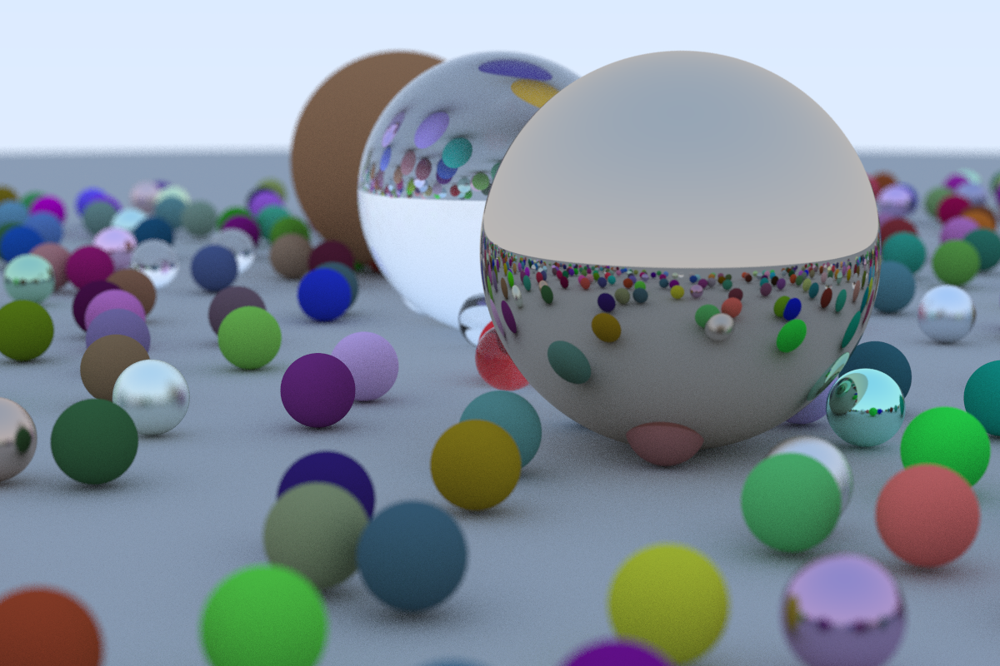

# Raytracing in Rust 

Basic Raytracing in Rust, following the instruction from (https://misterdanb.github.io/raytracinginrust/). This project is meant for personnal learning and eduction on both rust and ray tracing and is meant to evolve.

## Results 

### 21 April 2023 

#### image



#### Parameters

```rust
  //Image 
  const ASPECT_RATIO : f64 = 3.0/2.0;
  const IMAGE_WIDTH: u64 = 1200;
  const IMAGE_HEIGHT: u64 = ((IMAGE_WIDTH as f64) / ASPECT_RATIO) as u64;
  const SAMPLES_PER_PIXELS : u64 = 100;
  const MAX_DEPTH: u64 = 10; 
  // World
  let world = random_scene();

  // Camera
  let lookfrom = Point3::new(13.0, 2.0, 3.0);
  let lookat = Point3::new(0.0, 0.0, 0.0);
  let vup = Vec3::new(0.0, 1.0, 0.0);
  let dist_to_focus = 10.0; 
  let vertical_fov = 20.0;
  let aperture = 0.1;
```
